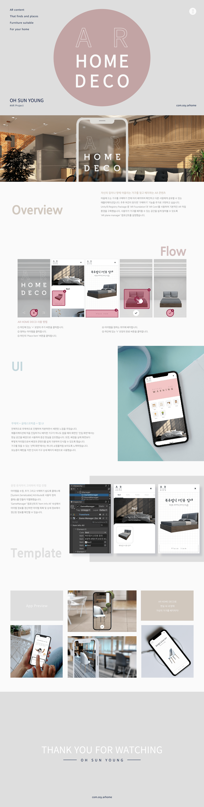

# AR HOME DECO
**증강현실 오브젝트 배치 시뮬레이션**

&lt;AR HOME DECO>는 현실 세계를 기반으로 한 공간 내에 원하는 가구를 배치하고 공유할 수 있는 증강현실 오브젝트 배치 시뮬레이션 애플리케이션으로 한국폴리텍대학 광명융합기술교육원 내에서 하는 프로젝트 경진대회에서 금상을 받았습니다.

> **작업 기간**&nbsp;&nbsp;&nbsp;&nbsp;&nbsp;2022.08.29 ~ 2022.09.22
> 
> **주요 기능**&nbsp;&nbsp;&nbsp;&nbsp;&nbsp;인식한 지면을 바탕으로 선택한 가구 배치. 가구를 배치한 화면 이미지 공유하기
> 
> **사용 도구**&nbsp;&nbsp;&nbsp;&nbsp;&nbsp;Unity 2021.3.2f1, Visual Studio
> 
> **사용 기술**&nbsp;&nbsp;&nbsp;&nbsp;&nbsp;AR Foundation, AR Core, XR Interaction Toolkit, Serializable Class
> 
> **참고 자료**&nbsp;&nbsp;&nbsp;&nbsp;&nbsp;한국폴리텍대학 광명융합기술교육원 AR 실습 수업 자료
>
> **다운로드**&nbsp;&nbsp;&nbsp;&nbsp;&nbsp;&nbsp;[구글스토어 바로가기](https://play.google.com/store/apps/details?id=com.osy.arhome "AR HOME DECO - Google Play 앱")

## 실행 화면

## 프로젝트 경진대회 내 안내 이미지

